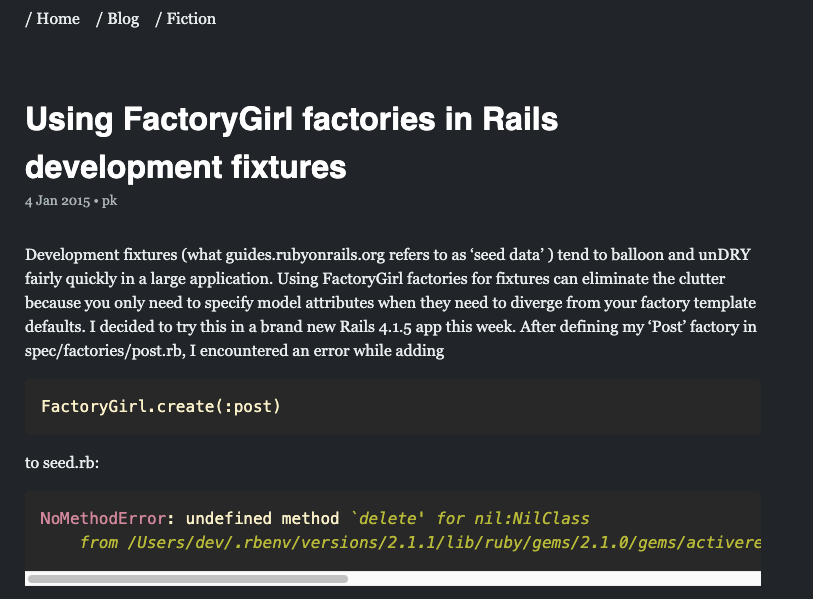

 # terraform-static-site

Objective: to provide a turn-key static blog/site hosted on AWS, with S3, CloudFront, and a custom domain name (not Route 53). This repo provides the all of the infrastructure for [peterkong.com](peterkong.com):

I wrote this as a way of teaching myself terraform. I recommend the [official terraform docs](https://www.terraform.io/docs/configuration/index.html) and [this Udemy course](https://www.udemy.com/course/learn-devops-infrastructure-automation-with-terraform/) if you want to dive deeper into terraform.

## Usage

- create an [AWS] account
- download the [terraform CLI](https://www.terraform.io/downloads.html)
- populate `terraform.tfvars` with your specific values
- deploy! `terraform validate && terraform apply`

This repo can be used in conjunction with [terraform-pkom](https://github.com/happythenewsad/jekyll_pkcom) to form a complete hosted CMS for your blog.

